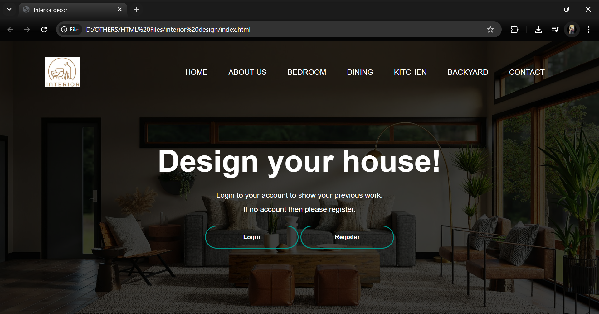

# 🏠 Interior Decor (WIP)

A stylish front-end web layout for an **Interior Decor** website. This project is currently built using **HTML and CSS**, with plans to add **JavaScript** for interactivity in the near future. It includes a full-page banner, navigation bar, and animated login/register buttons.

> ⚠️ **Note:** This project is still in development. JavaScript-based features like form validation, interactive UI components, and user authentication will be added soon.

---
## 💡 Features

- 🌐 Full-screen landing page with a modern layout
- 🧭 Navigation bar with hover effects
- 🎨 Animated login and register buttons
- 🎯 Clean, responsive design using HTML & CSS
- 🛠️ Future support for JavaScript-based interactivity

---

## 📁 Project Structure

project/
│
├── index.html # Main HTML file
├── styleid.css # CSS styling
├── logo.jpg # (Image required for logo)
├── decor.jpg # (Background image for banner)
└── script.js # (Planned JavaScript functionality)
---

## 🚧 Planned Features

- [ ] JavaScript-powered login and registration logic
- [ ] Form validation with error handling
- [ ] Responsive hamburger menu for mobile view
- [ ] Smooth scroll and section transitions
- [ ] Section expansion (About Us, Kitchen, Bedroom, etc.)
- [ ] Light/dark theme toggle

---

## 📸 Preview

---

## 🔧 How to Run

1. Clone this repository or download the ZIP.
2. Make sure the required images (`logo.jpg`, `decor.jpg`) are in the root folder.
3. Open `index.html` in a browser.
4. *(Coming soon)* Link `script.js` and add logic for user interactivity.

---

## 🧑‍💻 Author

- **Isha** — CSE Student & Web Developer in Progress 🚀

---

## 📌 Status

**🚧 Currently in Progress**  
HTML and CSS are done. JavaScript features will be added incrementally.
